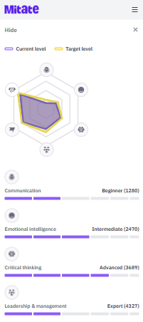
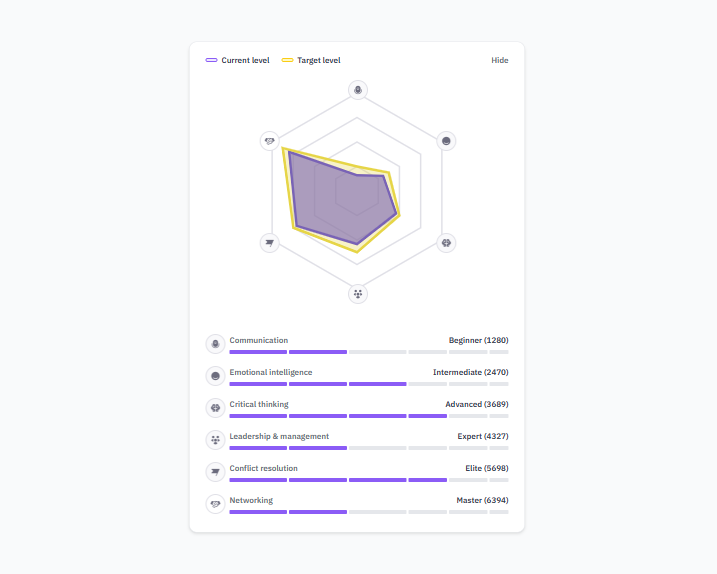

# Skill Progress Dashboard

An interactive dashboard that visually displays users' skill levels and growth using a radar chart and segmented progress bars. Built with **React**, **Tailwind CSS**, and **Recharts**, this project showcases beautiful data visualization adapted for both **desktop and mobile designs**.

## Features

- **Radar Chart** displaying current and target points per skill
- **Segmented Progress Bars** with varying segment widths (styled to match design)
- **Responsive Design** – optimized for desktop and mobile
- **Hide/Show toggle** to collapse or expand the skill cards
- **Custom Skill Icons** used across the chart and cards
- Styled using **Tailwind CSS**
- Design inspired by provided mockups

## 🛠️ Tech Stack

- [React](https://reactjs.org/)
- [Tailwind CSS](https://tailwindcss.com/)
- [Recharts](https://recharts.org/)

## 📂 Project Structure

src/
├── components/
│ ├── SkillCard.jsx # Renders each skill with progress bar
│ ├── SkillList.jsx # Container for all skills + chart
│ ├── SkillRadarChart.jsx # Recharts radar chart component
│ └── Header.jsx # Mobile header
├── data/
│ ├── chartData.js # Data for radar chart
│ ├── skills.json # Mocked skill data (points, levels, etc.)
└── App.jsx


## 📦 Getting Started

### 1. Clone the Repository

```bash
git clone https://github.com/your-username/skill-dashboard.git
cd skill-dashboard
```

### 2. Install Dependencies

```bash
npm install
```

### 3. Run the App

```bash
npm run dev
```

## Screenshots




## Data Format

```bash
{
  "name": "Communication",
  "current_level": "beginner",
  "points": 1280,
  "current_level_points": 280,
  "next_level_threshold": 2000,
  "level_name": "Beginner"
}
```

## Author
Esther Olubunmi Ajayi
Frontend & Backend Developer
[https://esthercoders.netlify.app/](https://esthercoders.netlify.app/)